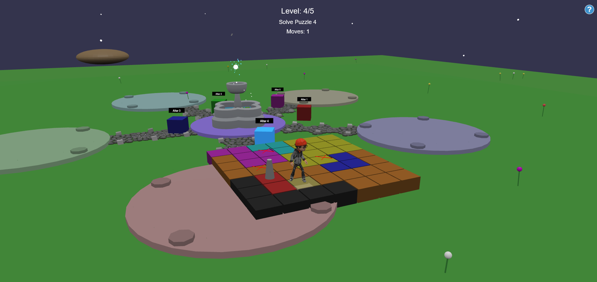

# Astral Queens

A 3D puzzle game built with BabylonJS and TypeScript where players solve queen placement puzzles in an interactive environment.


https://yisola2.github.io/Astral_Queens_GOW2025/

## Description

Astral Queens is a 3D puzzle game that combines spatial exploration with logical queen placement puzzles. The game features:

- 3D environment with character movement
- Physics-based interactions
- Five unique puzzles with increasing difficulty
- Interactive altars that reveal puzzles
- Real-time feedback and validation

## Game Objective

Place queens on a grid following these rules:
- Each row, column, and colored region must have exactly one queen
- Queens cannot be placed adjacent to other queens (horizontally, vertically, or diagonally)
- All puzzles can be solved using logic (no guessing required)

## Controls

- **WASD/Arrow Keys**: Move character
- **Mouse**: Look around
- **E**: Interact with altars / Place queen
- **R**: Remove queen
- **M**: Mark/unmark cell for planning
- **H**: Help screen

## Technologies Used

- TypeScript
- BabylonJS (3D rendering engine)
- BabylonJS GUI
- Havok Physics Engine
- Vite (build tool)

## Installation

1. Clone the repository
   ```bash
   git clone https://github.com/yisola2/Astral_Queens_GOW2025.git
   cd astral-queens
   ```

2. Install dependencies
   ```bash
   npm install
   ```

3. Run the development server
   ```bash
   npm run dev
   ```

4. Build for production
   ```bash
   npm run build
   ```

## Project Structure

- `src/`: Source code
  - `Game.ts`: Main game class
  - `Environment.ts`: 3D environment setup
  - `PlayerController.ts`: Character controls and physics
  - `GridManager.ts`: Puzzle grid logic
  - `AltarManager.ts`: Interactive altar objects
  - `UIManager.ts`: User interface and feedback
  - `InputManager.ts`: Input handling
  - `types.d.ts`: TypeScript type definitions

